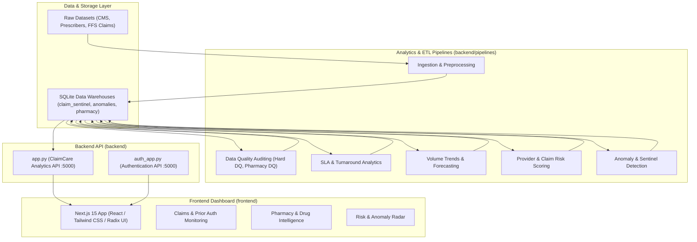

# ClaimCare - Healthcare Claims & Pharmacy Analytics Platform

ClaimCare is an enterprise-grade healthcare claims, prior authorization, and pharmacy monitoring intelligence platform. It provides end-to-end data pipelines for data quality auditing, SLA tracking, volume forecasting, risk scoring, and real-time anomaly detection, backed by interactive modern dashboards.

---

## 🏛️ System Architecture



---

## 📁 Repository Structure

```
ClaimCare/
├── backend/                              # Python backend services & data pipelines
│   ├── app.py                            # Main Flask Analytics API
│   ├── auth_app.py                       # User Authentication & Session API
│   ├── requirements.txt                  # Python dependencies
│   └── pipelines/                        # Modular processing & analytics engines
│       ├── anomaly_detection/            # ML anomaly detection (claims_anomaly, pharmacy_anomaly)
│       ├── data_quality/                 # DQ validation rules (data_quality, hard_quality, pharmacy_quality, auth_dq)
│       ├── ingestion/                    # Raw dataset parsers & ETL loaders (ingest, preprocess, pharmacy_db)
│       ├── risk_scoring/                 # Risk index calculations (claim_risk, pharmacy_risk)
│       ├── sla_analytics/                # SLA compliance engines (claim_sla, pharmacy_sla, auth_sla)
│       └── volume_analytics/             # Volume forecasting & metrics (volume, volume_pharmacy, auth_volume)
│
├── frontend/                             # Next.js 15 modern web dashboard
│   ├── app/                              # App router pages (dashboard, claims, drugs, providers)
│   ├── components/                       # Reusable UI components & ClaimCare application views
│   ├── lib/                              # Utility functions & helpers
│   ├── public/                           # Logos, icons, and static assets
│   ├── package.json                      # Frontend dependencies & scripts
│   └── tsconfig.json                     # TypeScript configuration
│
├── docs/                                 # Architectural summaries, recommendations & evidence
│   ├── claim_pharmacy_authorization_work_summary.md
│   ├── root_cause_recommendation_claims_pharmacy_authorization.md
│   ├── volume_claim_pharmacy_authorization.md
│   ├── evidence_output.json
│   └── root_cause_output.json
│
├── data/                                 # (Local only, .gitignored) Raw CSV/XLSX datasets & SQLite databases
├── .gitignore                            # Git ignore configuration
└── README.md                             # Project overview and guide
```

---

## 🚀 Quick Start

### 1. Prerequisites
- **Python 3.10+**
- **Node.js 18+** and **npm** / **pnpm**

---

### 2. Backend Setup

1. Navigate to the backend directory:
   ```bash
   cd backend
   ```

2. (Optional) Create and activate a virtual environment:
   ```bash
   python -m venv venv
   # Windows:
   .\venv\Scripts\activate
   # macOS/Linux:
   source venv/bin/activate
   ```

3. Install required packages:
   ```bash
   pip install -r requirements.txt
   ```

4. Run the Analytics API server:
   ```bash
   python app.py
   ```
   *The Analytics API runs on `http://localhost:5000`.*

5. Run the Authentication API server (if running separately):
   ```bash
   python auth_app.py
   ```

---

### 3. Frontend Setup

1. Navigate to the frontend directory:
   ```bash
   cd frontend
   ```

2. Install dependencies:
   ```bash
   npm install
   # or with pnpm:
   pnpm install
   ```

3. Run the development server:
   ```bash
   npm run dev
   # or
   pnpm dev
   ```

4. Open your browser and navigate to:
   ```
   http://localhost:3000
   ```

---

## 📊 Analytics Pipelines

Run individual ETL or analytics engines from the project root or `backend/pipelines/`:

| Pipeline Submodule | Primary Scripts | Purpose |
| :--- | :--- | :--- |
| **Ingestion** | `preprocess_pharmacy.py`, `ingest.py`, `preprocess_large.py` | Parses large CMS, FFS claims, and Medicare Part D datasets into SQLite |
| **Data Quality** | `hard_quality.py`, `pharmacy_quality.py`, `auth_dq.py` | Validates schema conformance, missing values, duplicates, and business rules |
| **Anomaly Detection** | `claims_anomaly.py`, `pharmacy_anomaly.py` | Detects abnormal spike patterns, outlier claim submissions, and dosage fraud |
| **SLA Analytics** | `claim_sla.py`, `pharmacy_sla.py`, `auth_sla.py` | Computes turnaround times, breach rates, and operational SLA performance |
| **Volume Analytics** | `volume.py`, `volume_pharmacy.py`, `auth_volume.py` | Aggregates daily/monthly volume, approval rates, and trend projections |
| **Risk Scoring** | `claim_risk.py`, `pharmacy_risk.py` | Assigns composite risk scores across providers, prescribers, and claim types |

---

## 🔒 Security & Data Privacy

- **Protected Health Information (PHI) & Raw Data**: All raw patient/claims CSVs, Excel files, and SQLite databases (`*.db`, `*.csv`) are excluded from version control via `.gitignore`.
- **Configurable Storage**: Database paths automatically resolve to local storage paths without hardcoded local machine directories.
